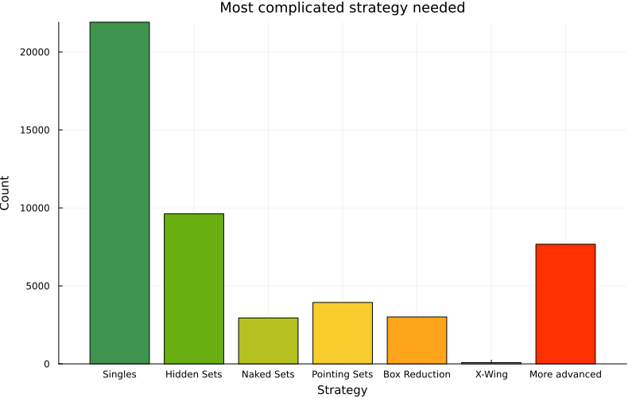

# A human-friendly Sudoku solver

The aim of this solver is not to be as fast as possible - like my other solvers [here](https://github.com/PhoenixSmaug/sudoku) - but to solve Sudokus like a human would. This allows one to follow the deductions of the solver step by step, to use it for learning or to get a hint when one is stuck. For that reason the solver never guesses or backtracks. The following strategies are implemented:

* [Singles](http://www.taupierbw.be/SudokuCoach/SC_Singles.shtml)
* [Hidden Pairs/Triples/Quads](http://www.taupierbw.be/SudokuCoach/SC_HiddenTriples.shtml)
* [Naked Pairs/Triples/Quads](http://www.taupierbw.be/SudokuCoach/SC_NakedTriples.shtml)
* [Pointing Pairs/Triples](http://www.taupierbw.be/SudokuCoach/SC_PointingPair.shtml)
* [Box Reduction](http://www.taupierbw.be/SudokuCoach/SC_BoxReduction.shtml)
* [X-Wing](http://www.taupierbw.be/SudokuCoach/SC_XWing.shtml)

Looking at the approximately 50,000 possible Sudokus with 17 clues (the smallest number of clues that allow unique solutions), we can plot the highest level of strategy required to solve them:

(c) Mia Müßig
